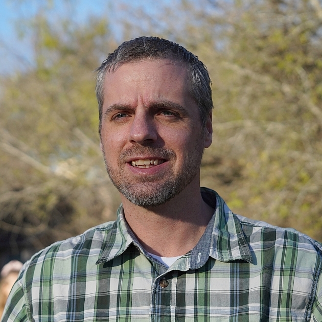

---
hide:
  - navigation
  - toc
  - path
---

# Frank L. Engel, Ph.D.

  
  

    Geographer · Hydrologic Remote Sensing · USGS
  

---

I develop and operationalize non-contact surface-water measurement technologies at the **U.S. Geological Survey**. My work spans image velocimetry, national hydrologic imagery infrastructure, and entropy-based discharge computation — bridging research-grade science with operational field practice at national scale.

-   :material-video-image:{ .lg .middle } **Image Velocimetry**

    ---

    Creator of IVyTools — the first operational software enabling USGS to measure river discharge from video. Trained 190+ staff nationwide.

    [:octicons-arrow-right-24: Learn more](projects/ivy-tools.md)

-   :material-cloud-upload:{ .lg .middle } **National Imagery Infrastructure**

    ---

    Co-Founding Architect of NIMS — cloud platform serving 1,000+ cameras and 110M+ images for hydrologic monitoring across the United States.

    [:octicons-arrow-right-24: Learn more](projects/nims.md)

-   :material-chart-bell-curve:{ .lg .middle } **Entropy-Based Discharge**

    ---

    Operationalized the Probability Concept method and built SurfVelTools for computing streamflow from minimal surface velocity observations.

    [:octicons-arrow-right-24: Learn more](projects/surfveltools.md)

-   :material-robot:{ .lg .middle } **ECHO AI Skunkworks**

    ---

    Founded a rapid-prototyping team evaluating AI-assisted tools for camera imagery and hydrologic workflows.

    [:octicons-arrow-right-24: Learn more](projects/echo.md)

-   :material-brain:{ .lg .middle } **ML Image Velocimetry**

    ---

    Deep learning frameworks for fully autonomous velocity estimation from river video — collaborations with Penn State and Stevens Institute.

    [:octicons-arrow-right-24: Learn more](projects/ml-image-vel.md)

-   :material-school:{ .lg .middle } **Training & Teaching**

    ---

    National training curriculum for non-contact methods — 190+ staff trained, plus university short courses and graduate advising.

    [:octicons-arrow-right-24: Learn more](projects/training.md)

---

[:fontawesome-brands-github: GitHub](https://github.com/frank-engel){ .md-button }
[:fontawesome-brands-linkedin: LinkedIn](https://www.linkedin.com/in/frank-engel-geographer/){ .md-button }
[:material-email: Contact](mailto:fengel@usgs.gov){ .md-button }

