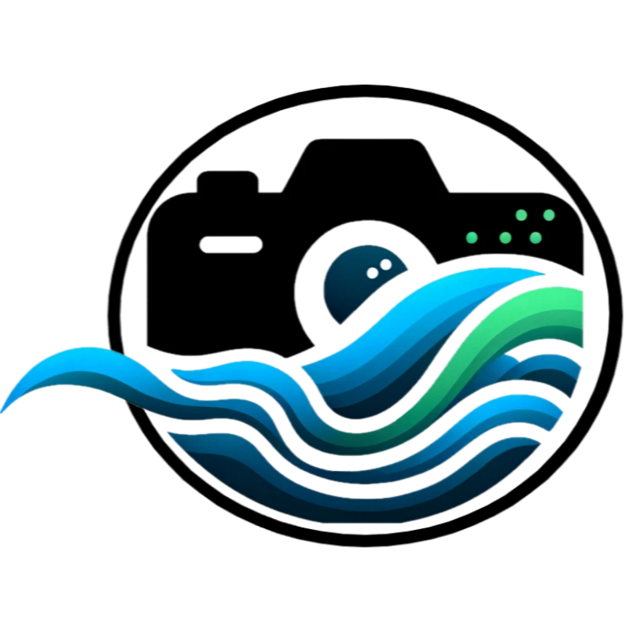

# Camera Data Collection Platform (CameraDCP)

<!-- 🖼️ TODO: Field deployment photo of Raspberry Pi unit at a streamgage -->

{ align=right width="300" }

**CameraDCP** is an edge computing platform that enables Raspberry Pi single-board computers to autonomously collect imagery and video from network cameras at remote USGS streamgages. It is deployed at 80+ sites and feeds imagery to the National Imagery Management System (NIMS).

[:material-file-document: DOI](https://doi.org/10.5066/P13SMLIZ){ .md-button .md-button--primary }

---

## Overview

Designed to supplement a traditional Data Collection Platform (DCP) at USGS gages, CameraDCP specializes in using cameras as observation or measurement sensors. The system supports scheduling measurements based on predefined times, external triggers, or internal level sensing, and can telemeter collected data to multiple destinations including NIMS.

## Key Capabilities

- **Autonomous operation** — solar-powered, limited connectivity, unattended
- **Flexible scheduling** — time-based, trigger-based, or level-sensing
- **Multi-camera support** — network cameras and Raspberry Pi camera modules
- **Telemetry** — automatic upload to NIMS and other destinations
- **Federal cybersecurity compliance** — designed for USGS security mandates
- **Remote management** — configuration and monitoring via secure channels

## Design Challenges

Building CameraDCP required innovation in autonomous hydrologic monitoring under severe constraints:

- Remote sites with limited/intermittent connectivity
- Solar power budgets requiring careful energy management
- Federal cybersecurity mandates (NDAA compliance)
- Diverse camera hardware from multiple manufacturers
- Extreme environmental conditions (heat, cold, humidity)

## Impact & Scale

| Metric | Value |
|--------|-------|
| Sites deployed | 80+ |
| Lines of code | 15,000+ |
| Camera types supported | Network cameras + Pi modules |
| Feeds to | NIMS (1,000+ camera network) |

## Recognition

- Enables downstream applications: image velocimetry, ML ice detection, water level monitoring

## Citation

Lee, A.M., **Engel, F.L.**, Andrews, S.J., Nicotra, M.J., and Gyves, M.C., 2025, Camera Data Collection Platform (CameraDCP): U.S. Geological Survey software release, [doi:10.5066/P13SMLIZ](https://doi.org/10.5066/P13SMLIZ).

## Technology

`Python` · `Qt5` · `Linux` · `Raspberry Pi` · `systemd`
