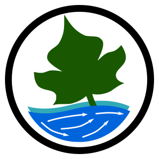

# Image Velocimetry Tools (IVy Tools)

<!-- 🖼️ TODO: Updated screenshot of IVyTools v1.4 UI needed -->

{ align=right width="300" }

**IVy Tools** is a 25,000+ line Python application that provides workflow support for processing video and imagery into water velocity and streamflow measurements. It is the first operational graphical application enabling USGS hydrographers to process video into validated discharge measurements using image velocimetry techniques.

[:material-gitlab: Source Code](https://code.usgs.gov/hydrologic-remote-sensing-branch/ivy){ .md-button }
[:material-file-document: DOI](https://doi.org/10.5066/P1KMVCNY){ .md-button .md-button--primary }

---

## Overview

Image velocimetry uses computer vision algorithms to extract river surface velocity fields from video, enabling discharge computation under conditions where contact-based methods are impractical or unsafe. IVyTools integrates a novel two-dimensional space-time image velocimetry (2D-STIV) algorithm within a graphical application designed for operational hydrographers.

## Key Capabilities

- **2D-STIV processing** — novel algorithm for extracting surface velocity vectors from video
- **Image orthorectification** — workflows for oblique field camera geometries with limited ground control
- **Quality control** — automated and manual QC for video data under variable conditions
- **Uncertainty quantification** — methods for image-derived velocities across diverse conditions
- **USGS data integration** — outputs compatible with National Water Information System workflows

## Impact & Scale

| Metric | Value |
|--------|-------|
| Lines of code | 25,000+ |
| Major releases | 5 |
| Validation videos processed | 200+ |
| Discharge range validated | 0.5–5,000 m³/s |
| Mean error | 6.2% (meets USGS standards) |
| Staff trained | 190+ across several national sessions |
| User consultations | 30+ |

## Recognition

- **De facto USGS standard** for image velocimetry processing
- **International adoption**: Environment Canada, New Zealand, SMHI (Sweden) evaluating for operations
- Presented at **WMO HydroHub Strategic Discussion** (May 2025) and **International Hydrometry Working Group** (Feb 2025)
- Cited in DOI Superior Service Award (2025)

## Publications

- Engel, F.L., Knight, T.M., Nystrom, E.A., and Grindle, C.B., *in review*, Image Velocimetry Tools (IVyTools) — A Windows software application for operational streamflow measurement processing: *River Research and Applications*.
- Legleiter, C.J., Kinzel, P.J., Engel, F.L., Harrison, L.R., and Hewitt, G., 2024, A two-dimensional, reach-scale implementation of Space Time Image Velocimetry (STIV) and comparison to Particle Image Velocimetry (PIV). *Earth Surface Processes and Landforms*, [doi:10.1002/esp.5878](https://doi.org/10.1002/esp.5878).
- Engel, F.L., and Knight, T., 2025, Image Velocimetry Tools (IVyTools): U.S. Geological Survey software release, [doi:10.5066/P1KMVCNY](https://doi.org/10.5066/P1KMVCNY).

## Technology

`python` · `Qt5` · `OpenCV` · `scikit-learn` · `SciPy` · `NumPy`
