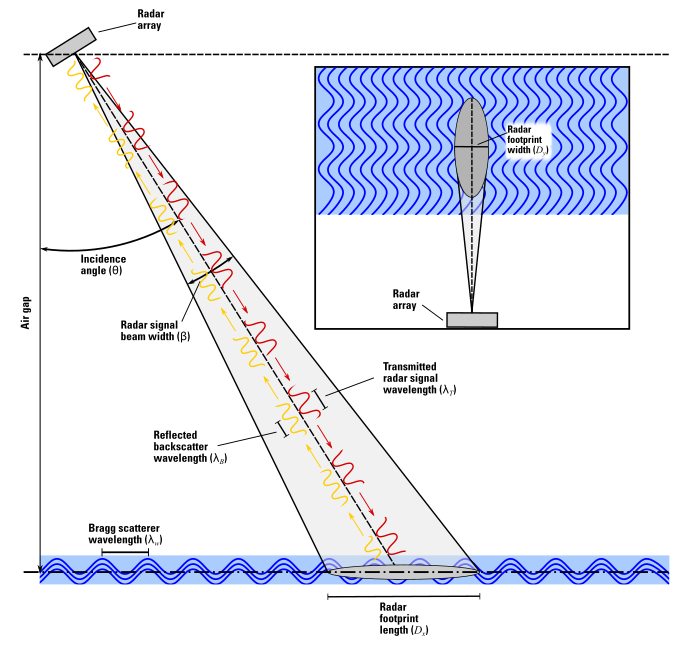

# Probability Concept Method

{ align=right width="300" }

The **Probability Concept** is a paradigm change for computing mean velocity and discharge. It applies Shannon entropy theory to predict the full velocity distribution from minimal surface velocity observations, substantially reducing data requirements for discharge computation.

[:material-book-open-variant: USGS TM 3-A26](https://doi.org/10.3133/tm3A26){ .md-button .md-button--primary }

---

## Overview

A conventional discharge measurement requires 25–30 point velocity observations distributed across the channel cross-section — time-consuming, expensive, and often dangerous during floods. The Probability Concept demonstrates that mean channel velocity can be estimated from far fewer observations if the underlying probability structure is known.

The method's reliance on surface velocity observations makes it naturally compatible with image velocimetry and radar-based remote sensing, directly integrating with USGS's broader non-contact measurement strategy.

## How It Works

1. **Parameterize** — Collect velocity profile data at the location of maximum in-channel velocity
2. **Estimate entropy parameters** — Determine the _M_ parameter characterizing the velocity distribution
3. **Measure surface velocity** — Using camera, radar, or other non-contact sensor
4. **Compute discharge** — Apply entropy relationships with known cross-sectional area

## Advantages

- Compute discharge immediately after a single site visit
- Measure at sites with complex streamflow conditions missed by stage-discharge methods
- Augment time-series data where gaps exist
- Reduce risk from ice, debris, and flood flows when surface velocity sensors are deployed
- Compatible with both fixed installations and mobile (drone) deployments

## My Role

As co-PI, I translated decades of theoretical work into an operational method by:

- Co-authoring the comprehensive USGS Techniques and Methods report (TM 3-A26)
- Contributing implementation procedures, uncertainty quantification, and operational guidelines
- Designing and building [SurfVelTools](surfveltools.md) — the software that operationalizes the method
- Developing drone-based workflows achieving 90-minute deployment

## Publications

- Fulton, J.W., **Engel, F.L.**, Eggleston, J.R., and Chiu, C.-L., 2025, Computing discharge using the entropy-based probability concept: U.S. Geological Survey Techniques and Methods book 3, chap. A26, 66 p., [doi:10.3133/tm3A26](https://doi.org/10.3133/tm3A26).
- Morel, D.B., Kirk, C.A., Fulton, J.F., **Engel, F.L.**, et al., *in review*, Measuring river discharge using drone-based cameras, entropy-based probability concept, and image velocimetry algorithms: *Remote Sensing*.
