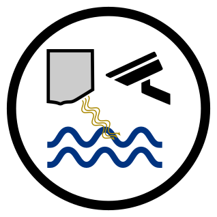

# Surface Velocity Tools (SurfVelTools)

{ align=right width="300" }

**SurfVelTools** is a 12,000-line Python application that operationalizes the entropy-based Probability Concept method for computing stream discharge from surface velocity observations. It is the first operational entropy-based discharge computation system deployed in a national water monitoring agency.

[:material-gitlab: Source Code](https://code.usgs.gov/hydrologic-remote-sensing-branch/surface-velocity-tools){ .md-button }
[:material-file-document: DOI](https://doi.org/10.5066/P9I5JABK){ .md-button .md-button--primary }

---

## Overview

SurfVelTools computes parameters associated with the Probability Concept method using velocity profile data collected where the maximum in-channel velocity occurs. It also computes streamflow for a given Probability Concept result given a known cross-sectional area, phi, and surface velocity — all variables measured in the field at a typical surface velocimetry gage.

## Key Capabilities

- **Entropy parameter estimation** — practical procedures for natural channels
- **Uncertainty quantification** — methods appropriate for operational settings
- **Profile fit evaluation** — automated assessment of velocity profile quality
- **Multi-sensor input** — integrates radar and camera velocity data
- **USGS data compatibility** — outputs for NWIS streamflow computation and submission
- **Archival and export** — results can be archived for recordkeeping

## Operational Advantages

The Probability Concept method offers significant operational improvements:

- **Rapid deployment** — installation typically complete in 2 days with discharge immediately computed (vs. years for rating development)
- **Reduced site visits** — 3–5 visits annually vs. 4–8 for conventional methods
- **Safe flood measurement** — bridge-mounted sensors enable measurements without personnel deployment
- **Continuous monitoring** — 15-minute discharge records from permanently mounted sensors
- **Drone workflow** — 90-minute deployment vs. 3–4 hours for conventional measurements

## Impact

- Deployed nationally as official USGS tool
- Documented in USGS Techniques and Methods report (TM 3-A26)
- Used at multiple gages with both radar and camera inputs
- Applied during major floods for discharge data that contact methods could not obtain
- Base algorithms being adopted in other USGS software (e.g., QRev)

## Citation

Engel, F.L., 2023, Surface Velocity Tools (SurfVelTools): U.S. Geological Survey software release, [doi:10.5066/P9I5JABK](https://doi.org/10.5066/P9I5JABK).

## Technology

`Python` · `Qt5` · `NumPy` · `SciPy` · `lmfit`
